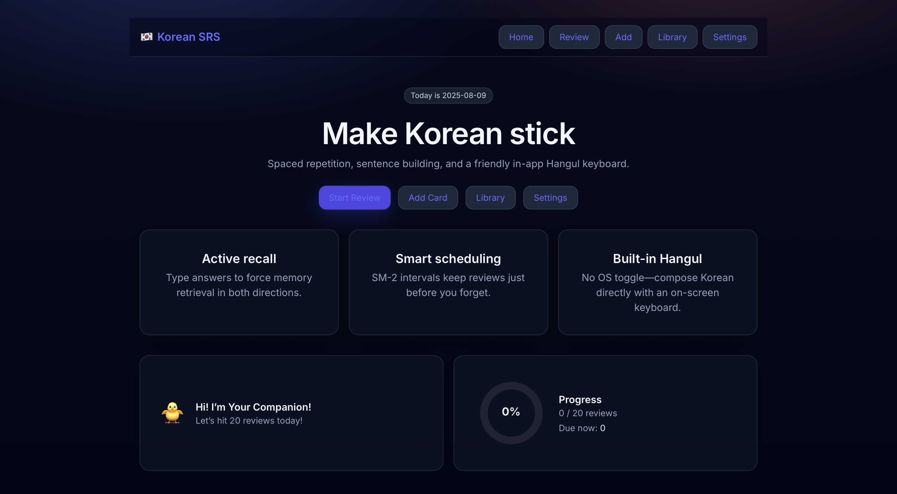
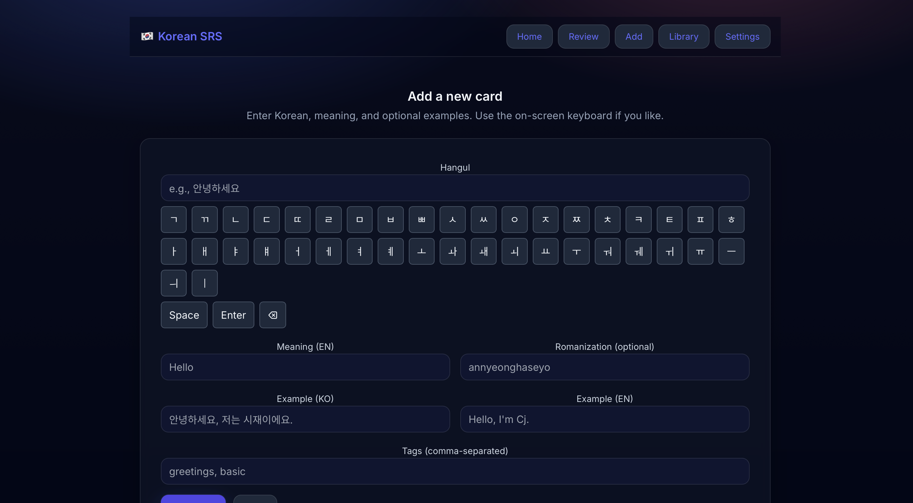

# 🇰🇷 Korean Recall

A **local-first flashcard trainer for Korean** — powered by a Spaced Repetition System (SRS) to help you retain vocabulary, grammar, and sentences longer.  
Practice daily with smart scheduling and fun visuals. Your data stays entirely on your device.

---

## ✨ Features

- 📝 Add, edit, and delete **flashcards**
- 📚 Organize cards into **Decks**
- ⏳ Review with **SM-2 spaced repetition**
- 📅 Track **daily review goals**
- 🐥 Fun mascot to motivate progress
- 📶 Works completely offline
- 📱 Responsive design for desktop & mobile

---

## 🖼 Screenshots

| Home Page | Add Card |
|-----------|----------|
|  |  |

---

## 🛠 Tech Stack

| Category              | Technology                  |
|-----------------------|-----------------------------|
| Framework             | [Svelte](https://svelte.dev/) |
| Dev Server/Bundler    | [Vite](https://vitejs.dev/) |
| Styling               | [TailwindCSS](https://tailwindcss.com/) |
| Storage               | [Dexie.js](https://dexie.org/) (IndexedDB) |
| Validation            | [Zod](https://zod.dev/) |
| Date handling         | [Day.js](https://day.js.org/) |
| Routing               | [svelte-spa-router](https://github.com/ItalyPaleAle/svelte-spa-router) |

---

## 📂 Project Structure

```
src/
 ├── components/           # Reusable UI components
 │    ├── MascotProgress.svelte
 │    ├── CardForm.svelte
 │    ├── ReviewPanel.svelte
 │    └── ...
 │
 ├── lib/                  # Logic, models, utilities
 │    ├── db.ts            # Dexie.js IndexedDB setup
 │    ├── models.ts        # TypeScript types
 │    ├── srs.ts           # SM-2 scheduling logic
 │    ├── progress.ts      # Daily review tracker
 │
 ├── routes/               # Page-level views
 │    ├── Home.svelte
 │    ├── Add.svelte
 │    ├── Review.svelte
 │    ├── Settings.svelte
 │    └── Library.svelte
 │
 ├── app.css               # Tailwind entry point
 └── main.ts               # App entry + router
```

---

## 📊 Data Models

**Deck**
```ts
export interface Deck {
  id: string;
  name: string;
  newPerDay: number;
  reviewLimit: number;
  createdAt: string;
}
```

**Card**
```ts
export interface Card {
  id: string;
  deckId: string;
  front: string;
  back: string;
  interval: number;
  ease: number;
  due: string;
  createdAt: string;
}
```

---

## 🚀 Getting Started

### Prerequisites
- **Node.js v20+** (required for Vite & Tailwind)
- npm or yarn

### Installation
```bash
# Clone repo
git clone https://github.com/1202DREAMSCAPE/KoreanLearningApplication
cd korean-srs

# Install dependencies
npm install

# Start dev server
npm run dev

# Build for production
npm run build
```

---

## 🔮 Roadmap

- [ ] Dark mode toggle  
- [ ] Import/export decks as JSON  
- [ ] Built-in starter decks (Korean 101)  
- [ ] Animated review feedback  
- [ ] Customizable mascot & daily goals  

---

## 📄 License

This project is licensed under the **MIT License** — see the [LICENSE](LICENSE) file for details.

---
